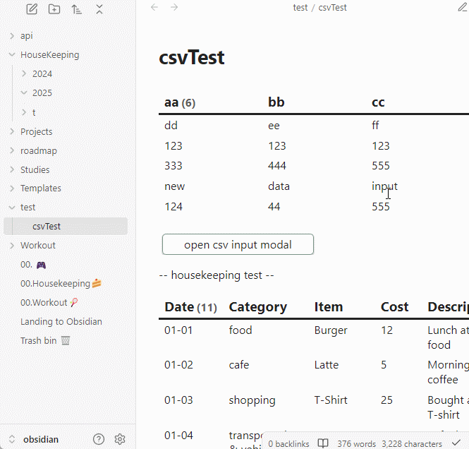
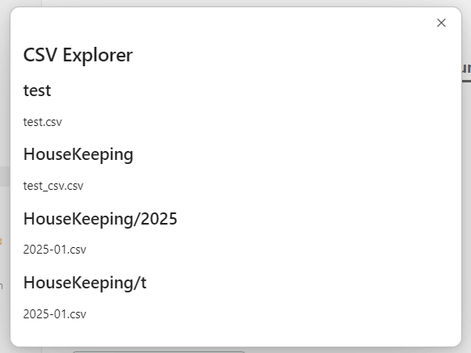
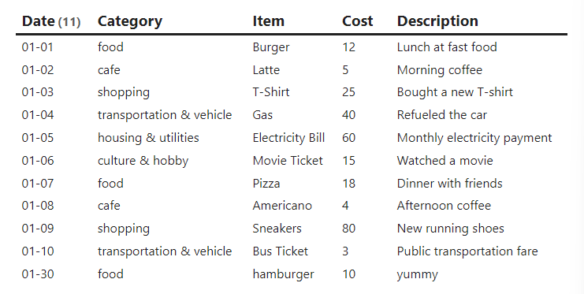

# CSV All-in-One
> A plugin for creating `.csv` files, modifying their data, saving them, and performing various CSV-related operations.
----
## Other Language Docs
- [Korean](./docs/README.kr.md)
- maybe add later...

## Brief Notice & Description
> This plugin is built with the assumption that you are using DataviewJS.
> The main purpose of this plugin is to create CSV files and add data to them.

----
## Examples
### With Obsidian Command
#### Creating a CSV File

- Ctrl + P -> search for 'Create CSV Table'
Enter the required data and click Submit as shown below:


#### Search CSV Files
- UI modifications are planned
- Ctrl + P -> search for 'Open CSV Explorer'
- You can move or delete CSV files.



### With DataviewJS

#### - View as table
- Source Code
```javascript
const CSVPlugin = app.plugins.plugins['CSV-allinone'];

const fileName = "HouseKeeping/t/2025-01.csv"; 

CSVPlugin.readCSV(app, fileName).then(res => {
	let headers = []
	let defaultValues = {}
	for(const [key, value] of Object.entries(res.headers)) {
		headers.push(key)
		defaultValues[key] = ""
	}
	const columnLength = headers.length;

	let rows = []
	for(const row of res.rows) {
		const newRow = [row[0].slice(5), ...row.slice(1)]
		rows.push(newRow);
	}
	dv.table(headers, rows);
})
```
- Result



#### - Add new data (row)
> This feature uses the Buttons plugin.
- Feature Description
	- Adds a row to a specific CSV file.
	- The data is not processed once read. If real-time updates are needed, you must wait for the file to update and read it again separately.
	- Default values can be entered.

- Source Code
```javascript
const CSVPlugin = app.plugins.plugins['CSV-allinone'];
const { createButton } = app.plugins.plugins["buttons"];

const fileName = "HouseKeeping/t/2025-01.csv"; 
const openCSVAppendModal = async(app, headers, f, defaults) => {
	 CSVPlugin.openCSVInputModal(app, headers, f, defaults)
}

CSVPlugin.readCSV(app, fileName).then(res => {
	let headers = []
	let defaultValues = {}
	for(const [key, value] of Object.entries(res.headers)) {
		headers.push(key)
		defaultValues[key] = ""
	}
	const columnLength = headers.length;

	let rows = []
	for(const row of res.rows) {
		const newRow = [row[0].slice(5), ...row.slice(1)]
		rows.push(newRow);
	}

	dv.table(headers, rows);
	// default values
	defaultValues['Date'] = moment(Date.now()).format('YYYY-MM-DD');
	defaultValues['Category'] = res.headers['Category'].options[0];
	defaultValues['Description'] = '-' ;

	dv.span(
	    createButton({
			app, el: this.container, 
			args: {
				name: "open CSV input modal",
				class: ""
			},
			clickOverride: {
				click: openCSVAppendModal, 
				params: [app, res.headers, fileName, defaultValues]
			}
		})
	)
})
```
- Result


#### - Add new column
#### - Delete existing column


### With Templater
- I am not familiar with Templater, so I can't provide much detail. Apologies.

----
## Usage/Features

----
## APIs
### Handle File
- readCSV
	- Parameters (app: App, fileName: string)
	- Return: Promise<CSVTable | null>
	> Takes a filename and returns the corresponding CSVTable.

- saveCSV
	- Parameters (app: App, fileName: string, table: CSVTable)
	- Return: void
	> Saves the CSVTable data into the given file.

### CSVTable (class)
-- Functions available within the class will be documented here.

#### Header (type)

#### CSVRow (type)

#### CSVCellType (type)


## How it Works
When you create a CSV file using this plugin, two files are generated: `.csv` and `.csv.meta`.
If you load an existing CSV file, a `.csv.meta` file is generated automatically.

The CSV file contains basic table data, while the `.meta` file contains information about each column's attributes.
Currently (v0.1.0), the `.meta` file only stores column types, but in the future, it will include additional data, such as select values or validity checks.

## Contributing
Feel free to contribute however you'd like. Contributions are always welcome!

## License
- MIT